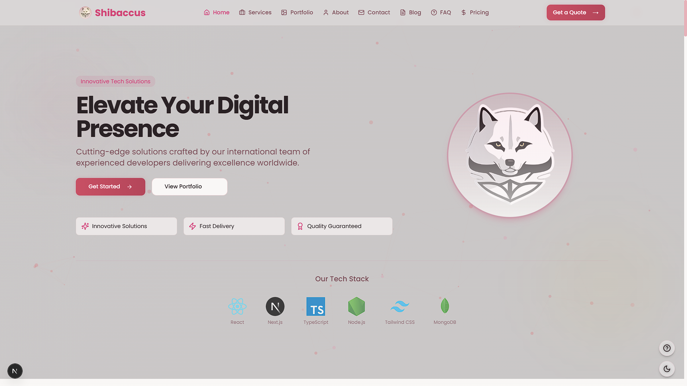
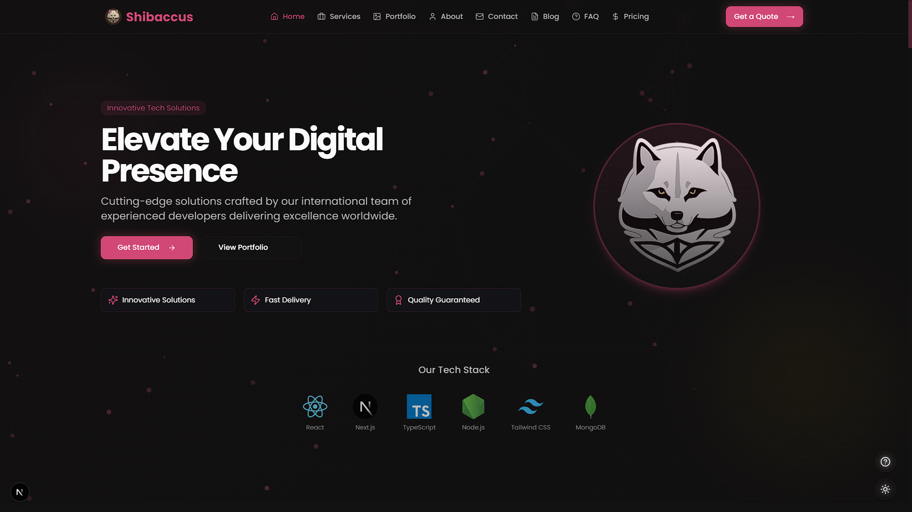
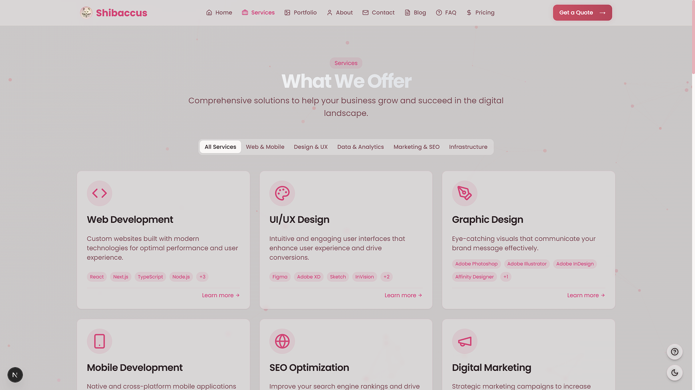
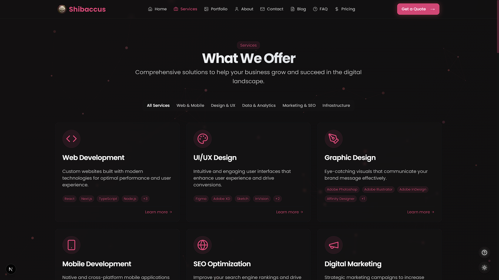
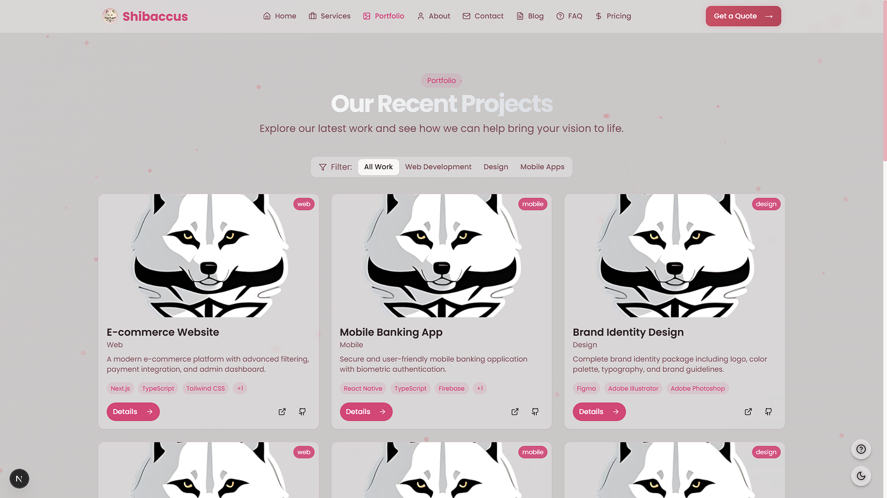
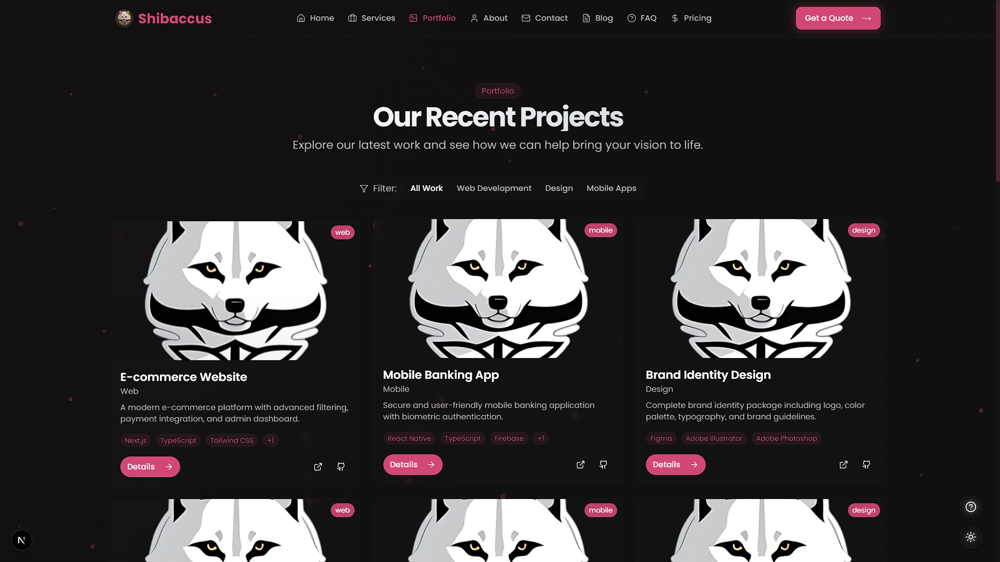

# Shibaccus Web


An innovative, modern website delivering tech solutions. Built with **Next.js** and **TypeScript**.

### **Live Demo**: Checkout the deployed version at [shibaccus-web.vercel.app](https://shibaccus.vercel.app)

---

## Badges

[](https://nextjs.org/)
[](https://www.typescriptlang.org/)
[](https://reactjs.org/)
[](https://tailwindcss.com/)
[](https://www.framer.com/motion/)
[](https://vercel.com/)
[](https://github.com/VoxDroid/Shibaccus-Web/blob/main/LICENSE)
[](https://github.com/VoxDroid/Shibaccus-Web)
[](https://github.com/VoxDroid/Shibaccus-Web/issues)
[](https://shibaccus.vercel.app)

---

## Table of Contents

- [Features](#features)
- [Screenshots](#screenshots)
- [Getting Started](#getting-started)
- [Usage](#usage)
- [Customization](#customization)
- [Project Structure](#project-structure)
- [Built With](#built-with)
- [Dependencies](#dependencies)
- [Key Features Explained](#key-features-explained)
- [License](#license)
- [Acknowledgments](#acknowledgments)
- [Contributing](#contributing)
- [Contact](#contact)

---

## Features

- **Modern UI/UX**: Rose gold-themed design with glass morphism effects.
- **Responsive Layout**: Optimized for mobile, tablet, and desktop devices.
- **Interactive Animations**: Smooth transitions powered by Framer Motion.
- **Dark/Light Mode**: Seamless theme switching with local storage support.
- **Comprehensive Pages**: Includes Home, Services, Portfolio, Blog, Pricing, About, Contact, and FAQ.
- **Accessibility**: ARIA-compliant and keyboard-navigable.
- **Performance Optimized**: Fast load times with optimized assets and Next.js features.
- **Blog Functionality**: Articles with search capabilities.
- **Contact Form**: Validated form for user inquiries.

---

## Screenshots

| Feature            | Light Mode                          | Dark Mode                          |
|--------------------|-------------------------------------|------------------------------------|
| Home Page          |||
| Services Section   |||
| Portfolio Section  |||

---

## Getting Started

Set up Shibaccus Web locally with these steps.

### Prerequisites

- **Node.js**: Version 18.0 or higher
- **Package Manager**: `npm`

### Installation

1. **Clone the Repository**
   ```bash
   git clone https://github.com/VoxDroid/Shibaccus-Web.git
   ```

2. **Navigate to the Project Directory**
   ```bash
   cd Shibaccus-Web
   ```

3. **Install Dependencies**
   ```bash
   npm install
   ```

4. **Start the Development Server**
   ```bash
   npm run dev
   ```

5. Open **[http://localhost:3000](http://localhost:3000)** in your browser to view the site.

---

## Usage

### Environment Variables
Create a `.env.local` file in the root directory:
```plaintext
NEXT_PUBLIC_SITE_URL=http://localhost:3000
```

### Commands
- **Development**: `npm run dev`
- **Build**: `npm run build`
- **Production**: `npm run start`
- **Lint**: `npm run lint`
- **Format**: `npm run format`

### Key Sections
- **Home**: Edit `app/page.tsx` for hero, services, and testimonials.
- **Services**: Update `app/services/` for offerings and details.
- **Portfolio**: Modify `app/portfolio/` to showcase projects.
- **Blog**: Adjust `app/blog/` for articles and search.

---

## Customization

### Changing Colors
Modify the theme in `tailwind.config.ts`:
```typescript
theme: {
  extend: {
    colors: {
      primary: "#e15e66", // Rose gold
    },
  },
};
```

Update CSS variables in `app/globals.css`:
```css
:root {
  --primary: #e15e66; /* Light mode */
}
.dark {
  --primary: #e15e66; /* Dark mode */
}
```

### Updating Content
Edit key components:
- Home: `app/page.tsx`
- Services: `app/services/`
- Portfolio: `app/portfolio/`
- Blog: `app/blog/`
- Contact: `app/contact/`

### Adding Animations
Tweak Framer Motion settings in components like `components/animate-in-view.tsx`.

---

## Project Structure

```plaintext
shibaccus-web/
├── app/                    # Next.js app directory
│   ├── about/              # About page
│   ├── blog/               # Blog pages
│   ├── contact/            # Contact page
│   ├── faq/                # FAQ page
│   ├── portfolio/          # Portfolio pages
│   ├── pricing/            # Pricing page
│   ├── services/           # Services pages
│   ├── api/                # API routes
│   ├── globals.css         # Global styles
│   ├── layout.tsx          # Root layout
│   └── page.tsx            # Home page
├── components/             # Reusable components
│   ├── ui/                 # Shadcn UI components
│   ├── animate-in-view.tsx # Animation component
│   ├── hero.tsx            # Hero section
├── hooks/                  # Custom hooks
├── lib/                    # Utility functions
├── public/                 # Static assets
│   ├── logo/               # Logo images
├── styles/                 # Additional styles
├── tailwind.config.ts      # Tailwind configuration
├── next.config.js          # Next.js configuration
├── tsconfig.json           # TypeScript configuration
└── package.json            # Dependencies and scripts
```

---

## Built With

- [Next.js](https://nextjs.org/) - React framework with App Router
- [TypeScript](https://www.typescriptlang.org/) - Type safety
- [Tailwind CSS](https://tailwindcss.com/) - Utility-first styling
- [Framer Motion](https://www.framer.com/motion/) - Animations
- [Shadcn UI](https://ui.shadcn.com/) - Customizable components
- [Vercel](https://vercel.com/) - Deployment platform
- [React Hook Form](https://react-hook-form.com/) - Form handling
- [Lucide React](https://lucide.dev/) - Icon library

---

## Dependencies

Key packages (from `package.json`):
- `next`
- `react`, `react-dom`
- `typescript`
- `tailwindcss`
- `framer-motion`
- `lucide-react`
- `react-hook-form`

Install with:
```bash
npm install
```

---

## Key Features Explained

### Glass Morphism Design
A modern UI effect applied via Tailwind CSS and custom styles in `app/globals.css`.

### Theme Switching
Toggle between dark/light modes with `ThemeToggle` component, persisting via local storage.

### Responsive Design
Mobile-first approach with Tailwind breakpoints for all screen sizes.

### Performance Optimization
Leverages Next.js server components, image optimization, and lazy loading.

---

## License

Licensed under the [MIT License](LICENSE). See the license file for details.

---

## Acknowledgments

- [Next.js](https://nextjs.org/)
- [Tailwind CSS](https://tailwindcss.com/)
- [Framer Motion](https://www.framer.com/motion/)
- [Shadcn UI](https://ui.shadcn.com/)
- [Lucide Icons](https://lucide.dev/)
- [Vercel](https://vercel.com/)

---

## Contributing

Contributions are welcome! Please read our [Contributing Guide](CONTRIBUTING.md) for details on how to contribute, and review our [Code of Conduct](CODE_OF_CONDUCT.md) to ensure a positive and inclusive community.

To contribute:
1. Fork the repository: [https://github.com/VoxDroid/Shibaccus-Web](https://github.com/VoxDroid/Shibaccus-Web)
2. Create a feature branch (`git checkout -b feature-name`)
3. Commit your changes (`git commit -m "Add feature"`)
4. Push to the branch (`git push origin feature-name`)
5. Open a pull request

---

## Contact

Questions or feedback? Reach out:
- **GitHub**: [@VoxDroid](https://github.com/VoxDroid)

## Support

For support, please refer to our [Support Guide](SUPPORT.md). If you encounter security issues, please review our [Security Policy](SECURITY.md).

If you find this project useful, consider supporting its development:

- **Ko-fi**: [Buy me a coffee](https://ko-fi.com/izeno)  
  [](https://ko-fi.com/izeno)
- **Star the Repository**: Give it a star on [GitHub](https://github.com/voxdroid/shibaccus-web)  
- **Report Issues**: Submit bugs or suggestions on the [Issues page](https://github.com/voxdroid/shibaccus-web/issues)

---

**Developed by VoxDroid**  
[GitHub](https://github.com/VoxDroid) | [Ko-fi](https://ko-fi.com/izeno)